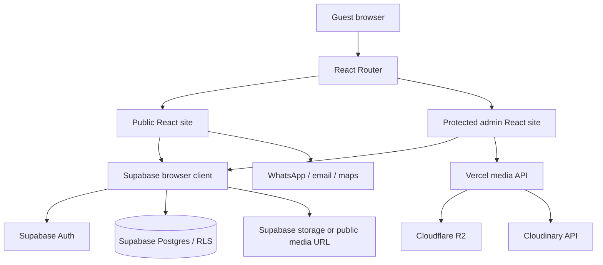
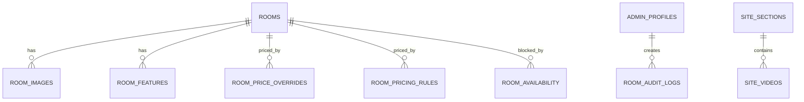

# System Architecture

## 1. Architecture Overview

The current system is a modular React single-page application served by Vite/Vercel, with a Supabase backend accessed through the browser using the anon key and a small set of Vercel serverless media endpoints. It is not a microservice system. The public site uses local fallback data/assets and optional published Supabase content; the admin site is routed under `/admin/*` and protected by Supabase Auth plus database-backed profile/RLS checks.



## 2. Current Repository Assessment

| Area | Verified state |
|---|---|
| App type | Vite + React 19 SPA |
| Public experience | One composed `App` with anchor sections and public route aliases |
| Admin experience | Login, dashboard, media library, rooms list/form/archive |
| Data | Supabase queries for rooms, content, images, gallery, feedback, pricing, availability |
| Auth | Supabase password auth plus `admin_profiles` lookup and lockout RPCs |
| Storage | Local public assets; Supabase public URLs; R2 presign/delete; Cloudinary signed uploads/delete |
| Working features | Public rendering, direct enquiry links, deferred admin route loading, client-rendered route metadata, skip-link access, admin route protection, room/media/content management code paths, pricing calculation, media endpoint input validation |
| Partial features | PIN recovery endpoints/migration (email delivery template mismatch), guest feedback presentation, video public rendering, reproducible room-schema migrations, automated type/test scripts |
| Risky areas | External schema dependency; optional environment configuration; user-entered external links; large public bundle; per-instance rate limiting; no automated test script |

## 3. Technology Stack

| Technology | Purpose | Constraint / alternative |
|---|---|---|
| React 19 | UI and state | Existing choice; keep component boundaries focused |
| Vite 6 | Dev server and production build | `vercel.json` rewrites all paths to `index.html` |
| React Router 6 | Admin/public route shell | Public sections still use anchors; avoid pretending every section is a separate page |
| Supabase JS | Auth, Postgres, storage | Requires external schema/RLS/functions; anon client is not authorization |
| Framer Motion | Reveal and interaction motion | Respect reduced-motion preference |
| CSS | Public/admin visual system | Tokens currently live in `src/styles.css`; admin reuses the public brand in `src/admin/admin.css` |
| AWS S3 SDK/presigner | R2 signing/deletion server code | Keep server-only; no direct secret exposure |
| ESLint 10 | Static JavaScript/JSX linting | `npm run lint`; React Compiler advisory rules are deferred because existing data-loading effects require a broader refactor |
| Playwright | Present dependency for browser QA | No npm script currently invokes it |
| Vercel | Hosting and serverless media/recovery API | Verify deployment environment variables, rewrite behavior, headers, and production rate-limit controls |
| Resend HTTP API | Admin PIN-recovery delivery | Server-only key and approved sender are required; end-to-end delivery is not yet verified |

## 4. System Context

Guests use the public SPA and leave the system to contact the hotel. Authenticated staff use the admin SPA. Supabase is the trust boundary for identity, role/profile state, Postgres records, RLS, and optional storage. Vercel functions receive authenticated bearer tokens for media operations and use server-side Cloudinary/R2 credentials.

## 5. Application Flow

1. User action occurs in a React component.
2. Native/browser or component validation runs where present.
3. A Supabase query or `/api/media/*` request is made.
4. Auth/session is attached by Supabase or explicitly as a bearer token.
5. Database RLS/server helper authorizes the request.
6. Input is validated in client code and API/database constraints.
7. Query/service logic executes.
8. Database/storage/external provider is updated or read.
9. Response/error returns to the component.
10. UI updates loading, success, empty, or error state.
11. Existing `data-cta` hooks and console error boundary support basic tracking/diagnostics.

## 6. Frontend Architecture

- Entry: `src/main.jsx` mounts `ErrorBoundary`, `BrowserRouter`, public route shell, and admin route shell.
- Public composition: `src/App.jsx`; static domain content: `src/data.js`; public styles: `src/styles.css`.
- Admin: `src/admin/*`, shared auth context, protected route, pages, panels, and `admin.css`.
- Data access: `src/lib/*` modules; components should call these modules rather than embedding provider logic.
- State: local React state/effects; no global state library verified.
- Loading/error: rooms explicitly expose loading/error; optional content/media reads fall back silently; error boundary catches render failures.
- Responsive: CSS media queries and mobile navbar/booking modal behavior; exact breakpoints must be kept synchronized with Design.md.

## 7. Backend Architecture

There is no conventional application server. Supabase PostgREST/Auth provides database/auth APIs; Vercel functions under `api/media` implement media presign/delete/signing and `api/admin` implements PIN-recovery requests. `api/_lib/security.mjs` supplies request IDs, body allow-lists, email validation, safe error responses, and per-instance rate limiting; `api/_lib/pinRecovery.mjs` creates hashed six-digit recovery challenges and sends email through Resend. `api/_lib/r2.mjs` authenticates bearer tokens, fetches the current admin profile, and performs provider operations. Business rules such as pricing precedence live in `src/lib/pricing.js` and should be shared or moved server-side before introducing authoritative reservations.

## 8. Database Architecture

The repository contains migrations for `site_images`, `site_sections`, `site_videos`, and `site_gallery_images`, with public-read/admin-read-write RLS. Code references additional externally provisioned tables: `rooms`, `room_images`, `room_features`, `room_price_overrides`, `room_pricing_rules`, `room_availability`, `admin_profiles`, `room_audit_logs`, `guest_feedback`, and login-lockout RPCs.



Required future architecture work: commit the base schema, indexes, constraints, migration order, backup/rollback procedure, and RLS definitions for all referenced tables. Do not infer their exact columns from client selects alone.

## 9. API Design

| Method / route | Auth | Purpose | Response/error |
|---|---|---|---|
| Supabase `rooms` select | Public RLS | Published room inventory and related data | Rows or Supabase error |
| Supabase `site_sections` select | Public RLS | Published content | Rows or fallback |
| Supabase `site_images` / gallery select | Public RLS | Active media | Rows or fallback |
| Supabase Auth sign-in/out | Credentials/session | Admin session lifecycle | Auth response/error |
| Supabase RPC lockout functions | Anonymous but tightly scoped | Check/record login attempts | Lockout row or error |
| `POST /api/media/presign` | Admin bearer | R2 upload URL | `{url,...}` or safe error |
| `POST /api/media/delete` | Admin bearer | R2 delete | status/error |
| `POST /api/media/cloudinary-sign` | Admin bearer | Cloudinary signed upload params | signature or safe error |
| `POST /api/media/cloudinary-delete` | Admin bearer | Cloudinary deletion | status/error |
| `POST /api/admin/request-pin-reset` | Public request with generic response | Create and email a recovery challenge for the configured admin email | `{ success }` or safe/rate-limited error |
| `POST /api/admin/verify-pin-reset` | Public request with valid challenge | Verify a six-digit OTP and issue a Supabase recovery token hash | `{ success, token_hash }` or safe/rate-limited error |

No reservation/payment API exists. Any future public mutation must define idempotency, rate limiting, validation, and a stable error envelope first.

## 10. Authentication and Authorization Flow

Admin login calls `signInWithPassword`, checks/records lockout through RPCs, then loads `admin_profiles`. `ProtectedRoute` rejects loading, missing/inactive profiles, and disallowed roles. Logout calls Supabase sign-out. Token refresh is delegated to Supabase client. PIN recovery uses `admin_pin_recovery_challenges`, a server-only service-role flow, hashed six-digit OTPs, expiry and attempt limits. The verifier returns a recovery token hash, but the current client does not consume it before calling `supabase.auth.updateUser`; therefore the reset completion flow is not verified and must be treated as incomplete. Controlled end-to-end delivery is also unverified, and the delivery copy incorrectly says “three-digit.” Server media functions independently call `requireAdmin`; browser route protection is not sufficient by itself.

## 11. File and Folder Structure

```text
/
├── api/                  # Vercel serverless endpoints; server secrets only
│   ├── _lib/             # shared server auth/provider helpers
│   └── media/            # presign/sign/delete handlers
├── public/               # immutable public assets, sitemap, robots
├── src/
│   ├── admin/             # admin pages, panels, auth context, admin CSS
│   ├── lib/               # provider/data-access and domain services
│   ├── App.jsx            # public composition (legacy large module)
│   ├── data.js            # verified fallback hotel content/assets
│   ├── main.jsx           # application entry/routes
│   └── styles.css         # public design tokens/components
├── supabase/
│   ├── migrations/        # ordered schema changes; add missing base schema
│   └── seed_site_sections.sql
├── docs/                  # QA, engineering, media, reference documentation
└── PRD.md Architecture.md Rules.md Phases.md Design.md
```

Naming: React components use PascalCase; library modules use camelCase; migrations use sortable UTC timestamps and descriptive snake_case; API files use lowercase route names. Keep provider credentials in server/API boundaries.

## 12. Component Architecture

Shared UI (`Button`, `SectionTitle`, `Reveal`, icons) should be extracted only when behavior is genuinely shared. Public feature sections remain page-level until their state/logic warrants extraction. Admin pages own forms and use `src/lib` services. Domain/API types should be separated if TypeScript is introduced; current code is JavaScript and runtime validation is currently limited.

## 13. Data Flow

Server state: Supabase rows fetched in effects. Client state: room/media lists, auth status, nav/modal state. Form state: controlled React inputs. URL state: pathname and hash anchors. Cached/persistent state: Supabase session; no application query cache verified. Do not add a state library before identifying repeated cross-page state.

## 14. Error Handling

Supabase errors are thrown from data modules and rendered by page-level error states where implemented. Optional public reads may deliberately fall back silently. Media APIs return status/error messages. The root boundary logs render errors and shows a safe refresh message. Future work should standardize `{ code, message, details? }`, map expected validation/auth errors, and avoid leaking provider internals.

## 15. Security Architecture

Trust boundaries: browser ↔ Supabase anon API; browser ↔ Vercel API; Vercel API ↔ storage/Resend providers. Enforce RLS and `requireAdmin` on server. Keep service credentials server-only. Validate media request body, file type, size, duration, and path; prevent path traversal and arbitrary object deletion. PIN recovery stores only OTP hashes, normalizes email input, responds generically, and applies IP/account-keyed per-instance limits. Never use client role/ownership claims as authorization. Audit room mutations. Production still needs shared rate limiting, upload byte inspection/malware scanning, a tested CSP/HSTS/CORS policy, and versioned base RLS migrations.

## 16. Performance Architecture

Current controls include eager hero image, lazy content images, responsive object-fit media, limited room query fields, public filtering, and a lazy-loaded `src/admin/AdminApp.jsx`. The verified initial public bundle is 632.58 kB minified (186.86 kB gzip); public routes do not request the 65.07 kB admin chunk. Future work: optimize/compress local assets, split the remaining public composition where profiling supports it, paginate admin inventory/gallery, add request deduplication, and measure Core Web Vitals before introducing caching/CDN changes.

## 17. Testing Architecture

`npm run lint` provides ESLint checks for the JavaScript/JSX and server-route code. `playwright` is installed but no automated test script is defined. Minimum future suite: pricing unit tests (precedence, weekend, expiry, ties), Supabase integration tests against a disposable project, component tests for booking/admin forms, Playwright public/admin smoke paths at mobile/tablet/desktop, keyboard/accessibility checks, and upload validation tests.

## 18. Environment Strategy

Local/dev/staging/prod must use separate Supabase projects or clearly separated schemas. Variables are listed in `.env.example`: public Supabase URL/key, public R2 base URL, server R2 credentials/bucket, server Supabase URL/service key, public Cloudinary cloud name, server Cloudinary credentials. Never commit `.env` or expose server secrets through `VITE_`.

## 19. Deployment Architecture

Build with `npm run build`; Vercel serves the Vite output and rewrites routes to `index.html`; media endpoints run as serverless functions. Deployment must include migrations in controlled order, environment variables, storage bucket/CORS policy, domain/SSL, health/smoke checks, and rollback instructions. Production migrations require explicit authorization.

## 20. Observability

Verified: browser console error in the root boundary, user-facing errors in several admin forms, and audit-log write helper. Missing/planned: centralized error monitoring, structured server logs, uptime checks, alert thresholds, Core Web Vitals, and analytics provider.

## 21. Architectural Decisions

### ADR-001: Keep a modular SPA with Supabase rather than introducing microservices

- Status: Accepted
- Context: Existing code is a Vite/React SPA with Supabase and small media functions.
- Decision: Preserve this shape; add boundaries only when a concrete requirement needs them.
- Alternatives: Rewrite to a full-stack framework or split services.
- Consequences: Lower migration cost; browser data access and external schema completeness remain important risks.

### ADR-002: Support Cloudinary and R2/Supabase media paths

- Status: Accepted, migration policy unresolved
- Context: Existing assets and code support multiple providers.
- Decision: Keep provider abstraction and server-side signing; choose one production default through stakeholder decision.
- Consequences: Better migration flexibility; more configuration/test combinations.

### ADR-003: Load the administrative application only for admin routes

- Status: Accepted and implemented
- Context: The administrative application was included in the initial public bundle.
- Decision: `src/main.jsx` lazy-loads `src/admin/AdminApp.jsx` within a `Suspense` boundary for `/admin/*`.
- Alternatives: Keep one eager application bundle; introduce a separate deployment.
- Consequences: Public visitors download less JavaScript; admin routes require an extra chunk and must retain loading/error verification.

## 22. Technical Risks

- External undocumented base schema: high impact; version schema and CI checks.
- Large public composition file: medium impact; extract only stable feature boundaries.
- Silent optional fetch failures: medium impact; add diagnostics without breaking fallbacks.
- Browser-only pricing if reservations are added: high impact; move authoritative calculation server-side.
- Per-instance rate limiting: high impact; add a shared production limiter before relying on it for abuse prevention.
- Large image/video assets: high impact; replace with approved compressed derivatives and test mobile LCP.
- Client-only SEO metadata: medium impact; prerender/SSR public routes before claiming complete crawler coverage.

## 23. Open Technical Questions

Confirm schema ownership, migration export, production storage provider, provider CORS, role matrix, monitoring, analytics, canonical production hostname, CSP/HSTS policy, shared rate limiter, recovery-email sender/delivery test, and whether a future reservation backend is required.
